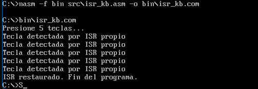
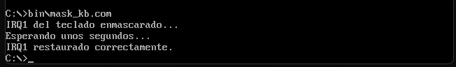
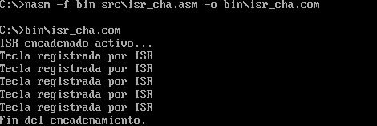

# Laboratorio Unidad 9 - ISR y PIC 8259A

## Descripción
Implementación de rutinas de servicio de interrupción (ISR) en ensamblador x86 utilizando el PIC 8259A y manejo de IRQ1 para el teclado en DOSBox.

## Estructura
- src/ → archivos ASM
- bin/ → ejecutables COM
- capturas/ → evidencias

## Programas
- isr_kb.asm → ISR personalizado para IRQ1
- mask_kb.asm → enmascaramiento de IRQ1
- isr_chain.asm → encadenamiento del ISR

## Herramientas
- NASM
- DOSBox
- Arquitectura x86

## Evidencias

## 1: ISR personalizado para IRQ1

Se implementó una rutina de servicio de interrupción personalizada para IRQ1 (teclado), reemplazando temporalmente el handler original de INT 09h y restaurándolo después de atender 5 pulsaciones.

## 2: Enmascaramiento de IRQ1

Se implementó el enmascaramiento temporal de IRQ1 mediante modificación del IMR del PIC 8259A usando el puerto 21h y posterior restauración de la máscara original.

## 3: Encadenamiento de ISR

Se implementó una simulación de encadenamiento de ISR para teclado, registrando pulsaciones mientras el sistema continúa respondiendo normalmente a la entrada del usuario.

